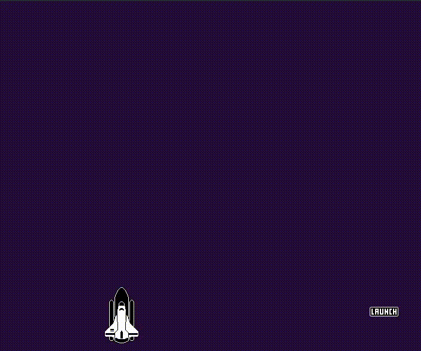

# Rocket Launch 

This is a simple rocket launch build in gdscrit on Godot.
The goal is understand the basic of how to Godot workd

## Useded functions

 - Signal
 - Simple AnimationPlayer
 - 2d pixel mode
  
